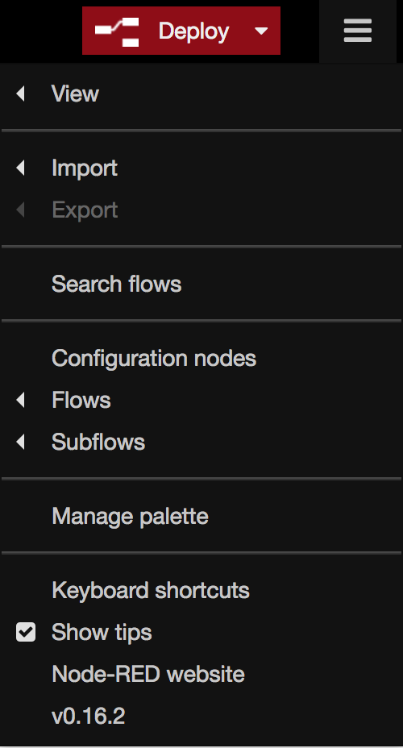
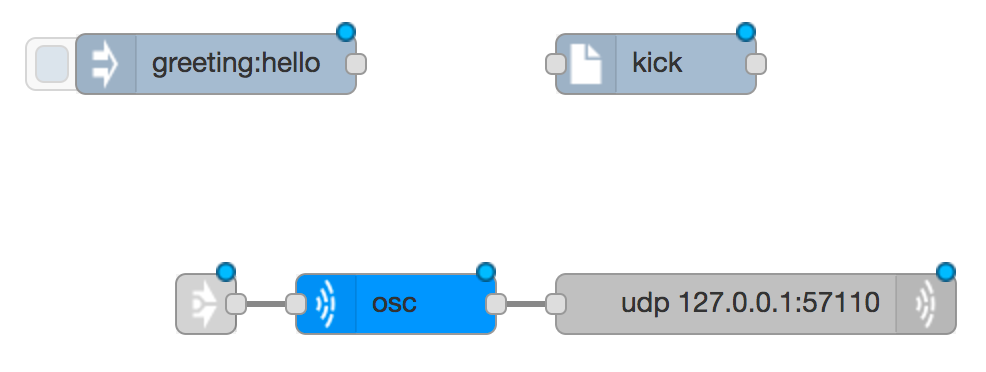
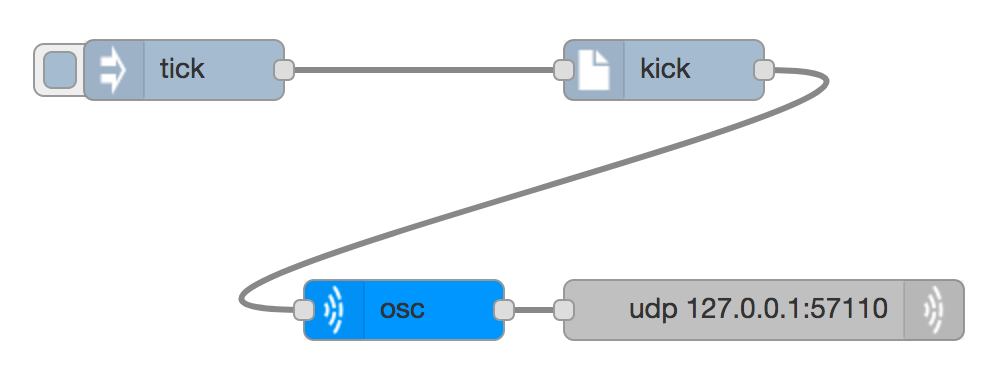
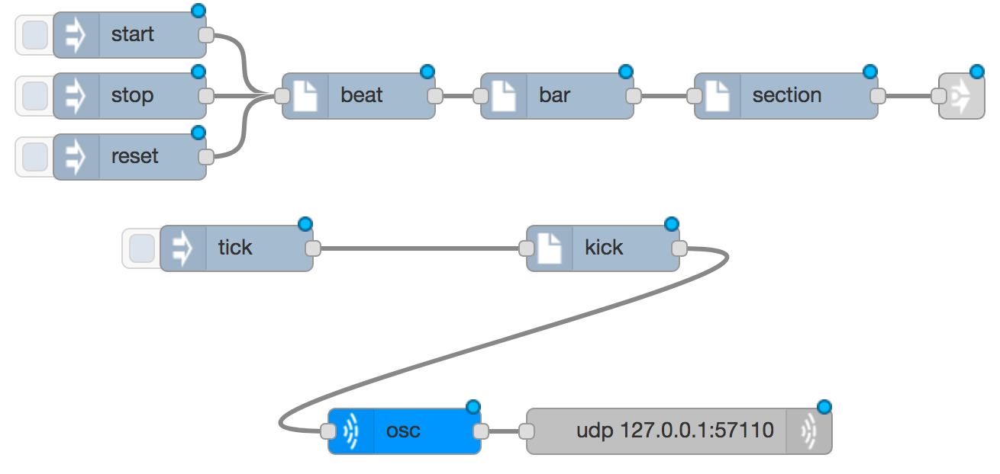
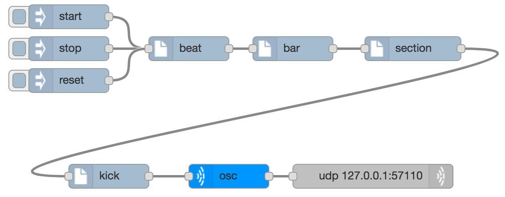
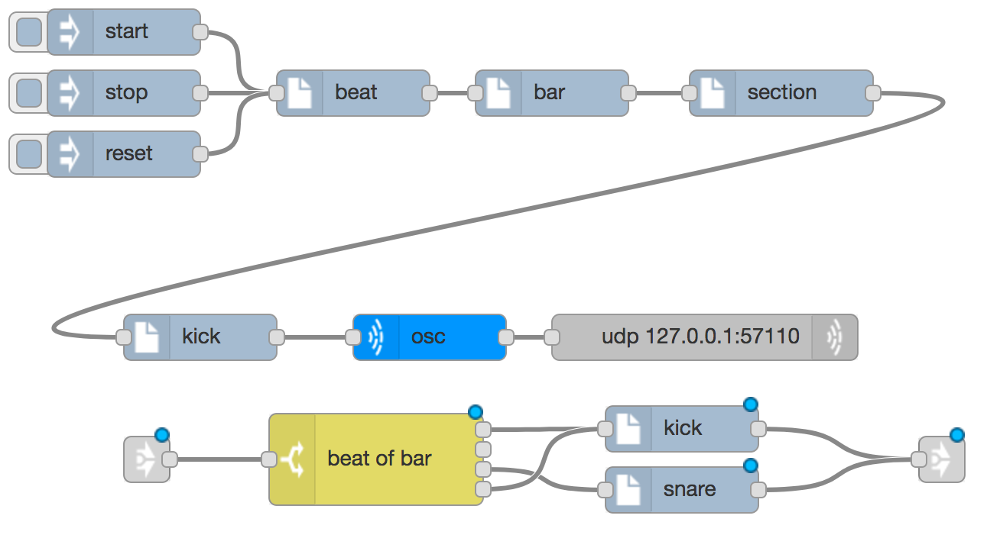
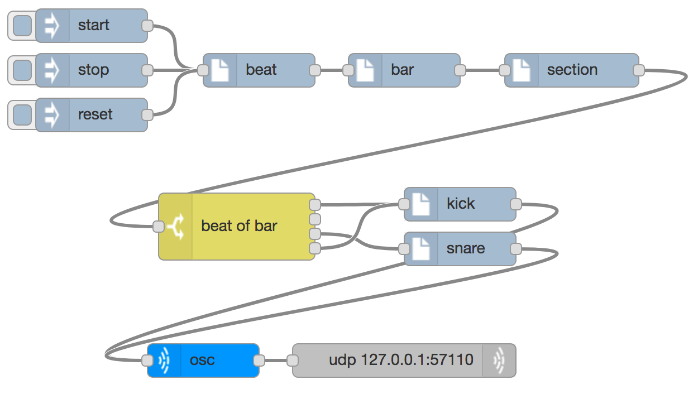

# Making Music

* [My first sound](#my-first-sound)
* [Making lots of sounds](#lots-of-sounds)
* [Drum beats](#drum-beats)
* [Deployment options](#deployment-options)
* [Creating a drum beat](#creating)

## My first sound

In [node-red basics](node-red-basics) you used an `inject` node to send a message to another node (debug) running inside the node-red server. This just involved communication between the web browser and the node-red web server. Next you are going to send a message to another program running on the same computer, but in a different program: SuperCollider. SuperCollider is going to generate sounds for us.

First of all delete the debug node by selecting it and hitting the delete/backspace key. To select it just click on it, and you will see it outlined in orange. To select many nodes, either to delete them or move them around, drag a box around them with the mouse.

Next add a `synth` node, which is in the _music_ section of the palette. By default this makes a bass drum (kick drum) sound, which will suit us fine. Next we need to get the synth instructions sent across to SuperCollider. To do this you are going to import some things from the library, where the relevant parts are already put together for you. At the top-right corner of the node red screen are the three lines of a "hamburger" menu.

Click on here and select Import > Library > Music > supercolliderOSC. Three pre-joined nodes appear which you can place anywhere, including an OSC node and a UDP node.

OSC stands for _Open Sound Control_: it is a protocol designed for
packaging music information, and the SuperCollider server expects
messages in this format. It is connected to a `udp` node (short for
User Datagram Protocol) which sends information between different
applications and computers using the Internet Protocol (IP). You will
now have a set of nodes that look something like this: 

You may recognise the IP address used by the UDP node (127.0.0.1) as the address for the computer you are working on. When you accessed the node-red server you used port 1880, but the SuperCollider server is connected to port 57110. Both the osc and udp nodes are already configured as we need them (that's why they were put in the library) but you need to work with the other nodes a little bit.

To the left of the osc node is another node with an arrow on that you don't need for now, so just delete it.

You need the output of the kick synth node to go to the input of the osc node, so add a wire between them.

The `inject` node needs to be configured to send a message with a payload of "tick" and no topic, and its output needs to feed the input of the kick synth, so add a wire to do that. Now you should have a flow looking a bit like this:

Deploy this and click on the `inject` and you should hear a drum-like sound. If you don't then make sure that

* You have something (probably headphones) plugged into the correct headphone socket.
* The sound isn't muted (see the top-right corner of the screen)
* You have started the SuperCollider server correctly (see [getting started](getting-started))

Once it is working you can try changing the configuration of the synth to try different instrument sounds (although it is better to avoid the sustained synths for now), starting volumes and octaves. When you are editing a node, or have selected it, details about the inputs, outputs and configuration appear in the _info_ tab in the sidebar on the right.

## Making lots of sounds

The next music node to look at is the `beat` node, which behaves like a metronome, sending out regular ticks at a given speed. The speed of the ticks is measured in _beats per minute_ (bpm), so that 60bpm is one per second. Beat nodes also accept messages to start, stop and reset them. The easiest way to get one set up is to import `beatgenerator` via the hamburger menu. This gives you a beat generator, with three `inject` nodes to start, stop and reset it, plus two divider nodes (called `bar` and `section`) and a link node. After importing the beat generator you will have something like this:

We will talk about the `bar` and `section` nodes later, but for now delete the link node on the right and the node for injecting `tick` that you defined before. Connect the output of `section` to the input of `kick` and you have something like this (the kick node has been moved here too):

In this flow when you click to inject a message with the payload `start` the beat generator will start sending `tick` messages through the two divider nodes, into the synth and then off to SuperCollider to make a sound like a toddler hitting a drum repeatedly. Once the interest of this dies away (this may take several seconds) then you can stop the beats and the sounds by injecting a `stop` or `reset` message.

The beat can be made faster or slower by configuring the `beat` node (try it). You can also change the speed of the beat while it is running by sending it a message with topic `bpm` and a payload of the new number of beats per minute. You can try this by adding one or more new `inject` nodes  which feed into the `beat` node.

##  Drum beats

The `beat` node doesn't just send messages with a payload of `tick`:
it includes other properties in the messages as well. You can look at
these by adding a new `debug` node which takes its input from
`beat`. If this is configured to display the `complete msg object` you
can see that it includes a property called `beat` and another one
called `start`. We're going to look at those now, as well as the
divider nodes `bar` and `section`.

Beats in music are very often grouped together into _bars_. It is
common for there to be four beats in a bar, but three and two and six
are also used - five, seven and nine less often. You can have as many
beats in a bar as you want, but the most I have ever seen is 15 and
that's very unusual. Usually the number of beats in a bar stays the
same throughout the piece but it can change, particularly in more
modern music.

What the `bar` node does is to divide the incoming beat ticks into
bars, and it does that by adding extra properties to the message as it
gets sent along. The `beat` property of the messages that get sent out
from the `beat` node are used to count the number of beats that have
been sent. If you use a debug node to look at the output of the `bar`
node you will see that it has two new properties: `bar` and
`beat_of_bar`. The `bar` property increases by one every four
beats. The `beat_of_bar` property increased by one every beat, but
resets to one again at the start of every bar. Also, if you look at
the `start` property it contains a list of things that start on that
tick. At the moment every tick is a beat, so the list always contains
"beat". But once every four beats, when `beat_of_bar` is one, the
`start` property list also contains "bar", to show that tick is also
the start of a bar.

Very interesting, but you were promised a drum beat, not just a lot of
chat about object properties. Go to the "hamburger" menu and import
"drumbeat". I recommend putting it at the bottom, so you get something
like this:

There are five new nodes here. Delete the link nodes at the left and
right hand end, as we have done before. Also delete the `synth` node
you had before, because instead you're going to use the `kick` and
`snare` synth nodes you have just imported.

Instead of the output of `section` going straight into the synths,
you're going to send it via the node marked `beat_of_bar`.

Also connect the two new synth nodes `kick` and `snare` to the input
of the `osc` node so that the sounds they make are sent to
SuperCollider.

To make things look prettier I've also moved the `osc` and `udp` nodes
underneath the new nodes we've added, so it looks like this:

Deploy it, inject a `start` into the beat generator and you should
hear a drum beat. If you look at the configuration of the `beat of
bar` node you can see that it of type `switch`, which means that when
it gets an input it chooses which output to send it to. In this case
it uses the `beat_of_bar` property of the message to choose the
output. Because the `kick` node is connected to outputs one and four
(they are counted from the top), then the kick drum is played on the
first and fourth beats of the bar. The snare drum is played on the
third beat of the bar.

Try removing or adding wires between the `beat of bar` node and the
`kick` and `snare` synths to make drum beats. This works because very
often drum beats are repeated the same every bar. If a song had the
same tune or words repeated over and over again it would probably
sound boring, but repeating the drum beat usually sounds good.

##  Deployment options 

On the right hand side of the "Deploy" button there is a pull-down
menu that allows you to choose between

* Full
* Modified Flows
* Modified Nodes

You can only make this selection if there is something to
deploy because something has changed. If you have to you
can fool the system into thinking something has changed simply by
moving a node to a slightly new position in the workspace.

"Full" deployment redeploys all of the nodes, even those that haven't
changed. If you are using that option then the `beat` node will always
return to its initial state i.e. not ticking. At the moment we have
only one flow, so "Modified Flows" does the same as "Full".

If you select "Modified Nodes" then you can change the pattern of the
drum beat while the beat is still going.

##  Creating a drum beat

Now it's over to you to create your own drum beat. You could try any, some
or all of the following. They get more difficult as you go through the
list, but more complicated isn't always better when it comes to drum beats.

* Re-wire the beats into the `kick` and `snare` synths on different
  beats of the bar
* Change the `kick` and `snare` synths to use different instruments
* Add one or more different synths: make more than one sound on the
  same beat if you want
* If you find the beat sounds a little bit uneven that is because the
  amount of time it takes for messages to pass through all the nodes
  will vary. You can fix this by adding some "latency" in the `beat`
  node, which will tell the beat to happen at a point in the future
  rather than immediately.
* Change the number of beats in the bar. Eight or sixteen beats allows
  you to do a more interesting rhythm. Mission Impossible uses ten
  beats, as does one of the regular tunes from Doctor Who. To do this
  you will have to reconfigure the `bar` node and add some more rules
  to the `beat of bar` switch node.
* Use the `bar_of_section` property which is added by the `section`
  divider nodes (there are eight bars in a section) so that the first
  or last bar of every section has a different rhythm (sometimes
  called a fill). You will need another copy of the `beat of bar` node
  to create another rhythm, plus another `switch` node that uses the
  `bar_of_section` property to choose which `beat of bar` node to send
  the tick to.
* Add a sub-beat to the beat generator at the bottom of the beat configuration. In music, half a beat is
  called a quaver, so there are two quavers per beat. 

Once you've got your drum beat created you can plug in a loudspeaker
instead of a pair of headphones and we can get to hear them all. The
next step is to do some [networking and collaborating](networking-and-collaborating).